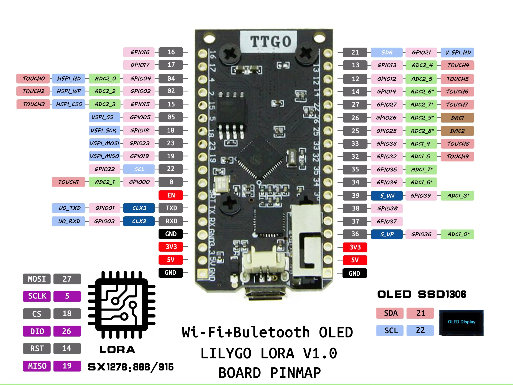
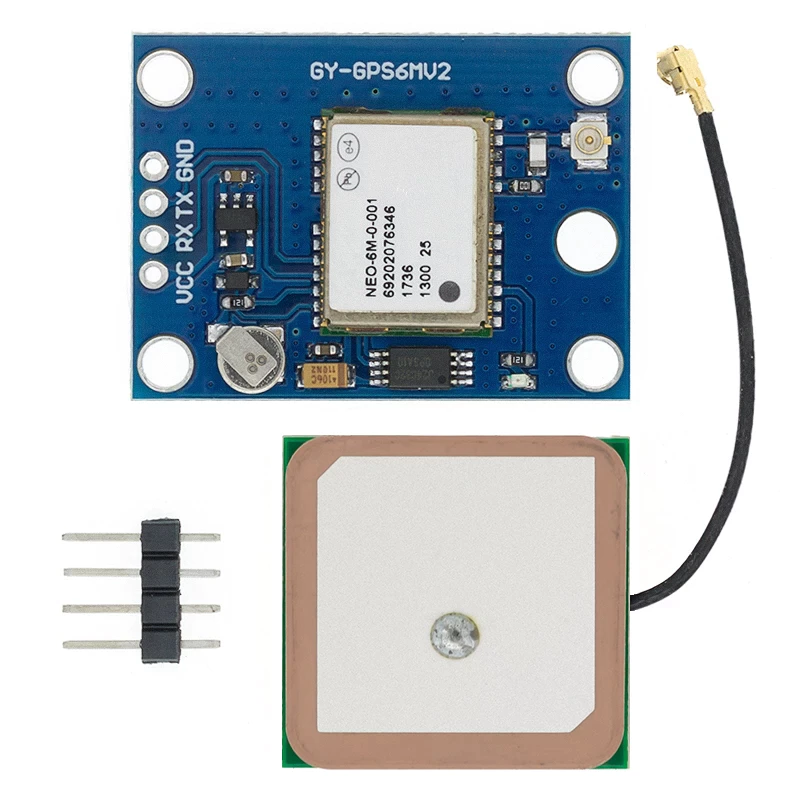

# Helium Network GPS Sensor

This guide is intended to provide a simple software to implement a basic GPS sensor on the Helium network. 

## The Hardware

The board that I chose for this project is the TTGO Lora32 v1. This board is based on the ESP32.

I use a Neo-6M GPS sensor connected at pin 12 and 13.

The code will work with many different dev boards, check the `LMIC-node Supported Boards list` if you have something other than the TTGO Lora32.

### Enter The Keys

Open the file `keyfiles/lorawan-keys.h`. Enter the key info from Helium console.

### Customize The Settings

Open the file `platformio.ini`. Enter the environment variables.

*	**default_envs** – enter the board if you are using something other than the TTGO Lora32.

*	**DO_WORK_INTERVAL_SECONDS** – how often do you want to send a GPS packet? Default at 1 packet per minute.
